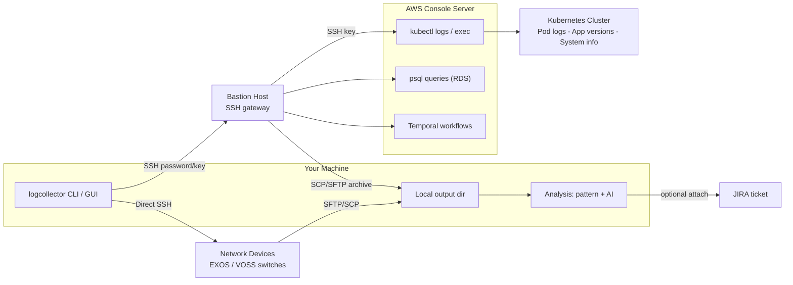

# LogCollector

## What It Does

LogCollector is a command-line tool that automates the collection of logs and diagnostics from Kubernetes clusters and network devices through our SSH bastion host. Instead of manually SSH-ing into systems, navigating directories, and copying files, this tool handles everything with a single command. This utility can significantly streamline our log collection and reduces the overhead.

## Key Features

- **Kubernetes log collection** — Gathers pod logs across namespaces with time-based filtering (e.g., last 15 minutes), includes system info and application versions
- **Temporal workflow support** — Simplifies complex workflow log collection by automatically gathering workflow histories, schedules, and correlated logs across services
- **Database query collection** — Execute PostgreSQL queries via SSH tunneling (Bastion → AWS → RDS) with cross-database parameter passing and automatic dependency resolution
- **Network device diagnostics** — Executes CLI commands on EXOS/VOSS switches and downloads logs via SFTP and SCP
- **Dynamic device detection** — Automatically discovers devices from the database (hm_device table) by `ownerID`, with type-based default credentials and NOS log paths
- **Automatic owner ID resolution** — Resolves `ownerID` from login email via `accountdb`, so users don't need to know their tenant ID
- **Message filtering** — Extract specific log entries by key-value pairs or strings, with Loki-style replica merging
- **Log analysis** — Pattern-based error detection with severity classification, correlation ID tracking, and grouped error reporting
- **Replica handling** — Automatically merges logs from replica pods and filters out old pod logs from persistent directories
- **Fast transfers** — Uses native SCP or SFTP with automatic bastion → AWS → local routing
- **JIRA integration** — Upload collected logs directly to JIRA tickets with `logcollector.exe --all --jira XCP-12345`

## Benefits for Daily Work

- Reduces log collection time from 15–20 minutes to 2–5 minutes
- Eliminates manual SSH session juggling and file transfers
- Provides organized output with analytics reports for faster root cause analysis
- Highly configurable — when new services are added to the cluster, simply add an entry to `config.yaml` — no code changes required
- Extensible design — supports any cloud-based application (ExtremeCloud IQ, wireless, etc.) through configuration
- Standardizes log collection across the team
- Works across all platforms (Windows, Linux, macOS)

## Safety Notes

- **System info commands are read-only** — Only observation commands (e.g., `kubectl get`, `kubectl describe`, `kubectl top`) are used. No configuration, update, or delete commands are ever executed against the cluster.
- **Database queries are SELECT-only** — All SQL queries use `SELECT` statements. No `INSERT`, `UPDATE`, `DELETE`, `CREATE`, `DROP`, or `ALTER` operations are performed. The tool will not execute any data-modifying queries.
- **Network device commands are non-destructive** — Only `show` commands are executed on EXOS/VOSS switches. No configuration changes are made to network devices.

---

## How It Works



**Text version of the same architecture:**

```
                                                                    ┌──────────────────────┐
                                                                    │  Kubernetes Cluster  │
                                                                    │  ┌────────────────┐  │
                                                                    │  │ Pod logs       │  │
                                                                    │  │ Temporal data  │  │
                                                                    │  │ App versions   │  │
                                                                    │  │ System info    │  │
                                                                    │  └────────────────┘  │
                                                                    └──────────▲───────────┘
                                                                               │ kubectl
┌──────────────┐       SSH        ┌──────────────┐       SSH        ┌──────────┴───────────┐
│  Your Machine│──────────────────│   Bastion    │──────────────────│   AWS Console        │
│              │  (password/key)  │   Host       │   (SSH key)      │   Server             │
│  logcollector│                  │              │                  │                      │
│  .exe        │◄─── SCP/SFTP ────│              │◄─── archive ─────│  kubectl logs/exec   │
│              │   (downloads)    │              │                  │  psql queries (RDS)  │
│              │                  └──────────────┘                  └──────────────────────┘
│              │
│              │    Direct SSH    ┌───────────────────┐
│              │──────────────────│  Network Devices  │
│              │                  │  EXOS / VOSS      │
│              │◄─── SFTP/SCP ────│  switches         │
└──────────────┘   (downloads)    └───────────────────┘
```

**Config mode flow** (no arguments):
1. Reads `config.yaml` to determine which collections are enabled
2. Connects to bastion → AWS only if needed (skipped for device-only collection)
3. Collects Kubernetes logs, system info, app versions, database queries, device logs — based on what's enabled
4. Downloads archives to your local output directory
5. Optionally attaches results to a JIRA ticket

---

## Quick Start

### 1. Download

Pre-built binaries: [GitHub Releases](https://github.com/nperiannan/EP1LogCollector/releases/latest)

| Platform | Binary |
|---|---|
| Windows (x64) | `logcollector-windows-amd64.exe` |
| Linux (x64) | `logcollector-linux-amd64` |
| macOS (Intel) | `logcollector-darwin-amd64` |
| macOS (Apple Silicon) | `logcollector-darwin-arm64` |

Or build from source:
```bash
go build -o logcollector.exe    # Windows
go build -o logcollector        # Linux/macOS
```

### 2. Configure

Edit `config.yaml` — at minimum set these fields:

```yaml
┌─────────────────────────────────────────────────────────────────────────┐
│  ESSENTIALS - Change these values                                       │
└─────────────────────────────────────────────────────────────────────────┘
username: yourname                              # Your corp username
environment: dl2r1                              # Target environment (dl2r1, g2r1, g2r2, ws3r1, etc.)
env_login_id: "you@extremenetworks.com"          # XIQ login email — auto-resolves ownerID
ownerID: ""                                      # Or set manually if email is unavailable
```

### 3. Run

```bash
# Use config.yaml settings (collects whatever is enabled)
./logcollector

# Collect everything
./logcollector --all

# Collect and attach to JIRA
./logcollector --all --jira XCP-12345
```

---

## Operation Modes

### Config Mode (default — no flags)

Reads `config.yaml` and runs whichever sections have `enabled: true`:

| Config Section | What It Collects |
|---|---|
| `logCollection` | Kubernetes pod logs, temporal workflows, pod files |
| `systemInfo` | kubectl commands (pods, services, deployments, etc.) |
| `appVersionCollection` | Running container image versions |
| `databaseCollection` | PostgreSQL query results via psql aliases |
| `deviceLogCollection` | EXOS/VOSS switch diagnostics and log files |

### Explicit Modes

| Flag | Description | Requires Bastion |
|---|---|---|
| `--all` | Collect everything (respects per-section `enabled` flags) | Yes |
| `--logs-only` | Kubernetes logs only | Yes |
| `--sys-info` | System info commands only | Yes |
| `--version` | App version info only | Yes |
| `--database` | Database queries only | Yes |
| `--device-logs` | Network device logs only | **No** |
| `--analyze <path>` | Analyze local log files/directory | **No** |
| `--analyze-ai <path>` | AI root-cause analysis (launches GUI on the AI Analysis page) | **No** |
| `--gui` | Launch web-based GUI control panel (use `--gui-port` for a custom port) | **No** |

### Common Flag Combinations

```bash
# Collect logs from last 30 minutes
./logcollector --all --time-duration 30m

# Collect only device diagnostics
./logcollector --device-logs

# Database queries only
./logcollector --database

# Custom output directory
./logcollector --all --outdir C:\MyLogs

# Debug mode for troubleshooting
./logcollector --all --log-level DEBUG

# List available log archives on AWS (without downloading)
./logcollector --list

# Standalone analysis of already-collected logs
./logcollector --analyze /path/to/logs

# Analyze with custom report output directory
./logcollector --analyze /path/to/logs --outdir /path/to/reports
```

---

### Standalone Log Analyzer (`--analyze`)

Analyze previously-collected log files without connecting to any remote server. This mode reuses the same analysis engine that runs automatically during log collection.

**Features:**
- Recursive directory scanning — finds all text files in nested directories
- Auto-extracts `.tar.gz` archives found during scan
- Error pattern detection with configurable patterns from `config.yaml`
- Cross-file error correlation
- Correlation ID tracking (trace IDs, request IDs)
- Kubernetes pod status analysis
- Generates a detailed analytics report file

**Usage:**
```bash
# Analyze an entire directory tree
./logcollector --analyze /path/to/collected-logs

# Analyze a single file
./logcollector --analyze /path/to/logfile.log

# Analyze with report written to a specific directory
./logcollector --analyze /path/to/logs --outdir /tmp/reports
```

Analysis settings (error patterns, exclude keywords, context lines, correlation keys) are read from the `logCollection.logAnalysis` section of `config.yaml`.

---

### GUI Mode (`--gui`)

Launch a local web-based control panel to edit configuration, run collections, and browse output from the browser.

```bash
# Launch the GUI on the default port (9090)
./logcollector --gui

# Launch the GUI on a custom port
./logcollector --gui --gui-port 8080
```

The server runs at `http://127.0.0.1:<port>` and opens your browser automatically. Press `Ctrl+C` to stop it.

#### Windows launcher: `run-gui.ps1`

A PowerShell helper that wraps `--gui` with a custom-port option and an auto-build step.

**Usage:**
```powershell
.\run-gui.ps1                       # GUI on the default port (9090)
.\run-gui.ps1 -Port 8080           # GUI on a custom port
.\run-gui.ps1 -Port 8080 -Build    # Rebuild logcollector.exe first, then launch
.\run-gui.ps1 -Config my.yaml      # Use a different config file
```

**What it does:**
- `-Port` (default `9090`, validated to `1024–65535`) maps to the binary's `--gui-port` flag.
- Auto-builds `logcollector.exe` via `build.ps1` if it's missing or `-Build` is passed.
- Resolves paths relative to the script, so it works from any working directory.
- Pre-checks that the port is free (`Get-NetTCPConnection`) and exits with a clear message if it's taken.
- Runs `logcollector.exe --gui --gui-port <Port> --config <Config>`. The binary serves on `http://127.0.0.1:<Port>` and opens the browser itself; `Ctrl+C` stops it.

---

### AI-Powered Log Analysis (`--analyze-ai`)

Get LLM-driven root cause analysis of collected logs from the GUI's **AI Analysis** page. Launch straight into it with `--analyze-ai`, or open the GUI and pick **AI Analysis** from the sidebar.

```bash
# Launch the GUI directly on the AI Analysis page for a directory or file
./logcollector --analyze-ai /path/to/collected-logs
```

**Features:**
- Two providers:
  - **Local Claude CLI** (default) — uses your existing Claude Code login, no API key required.
  - **OpenAI-compatible API** — bring your own key, with a configurable endpoint and model (defaults: `https://api.openai.com/v1/chat/completions`, `gpt-4o-mini`).
- Accepts log **files** (plain text, `.gz`, `.tar.gz`/`.tgz` — archives are decompressed/extracted) or pasted log text.
- Optional **failure context** field to steer the analysis toward your specific issue.
- Returns a structured root-cause summary with likely causes and next steps — complements the pattern-based `--analyze` report.

> Tip: Run `--analyze` first for a fast deterministic pattern scan, then `--analyze-ai` on the same directory for a narrative root-cause explanation.

---

## Configuration Reference

The full `config.yaml` is organized into clearly labeled sections. Below is each section with its options.

### Essentials

```yaml
┌─────────────────────────────────────────────────────────────────────────┐
│  ESSENTIALS - Change these values                                       │
└─────────────────────────────────────────────────────────────────────────┘
username: yourname                          # Corp username (used for SSH, paths, JIRA)
environment: dl2r1                          # Target environment (dl2r1, g2r1, g2r2, ws3r1)
env_login_id: "you@extremenetworks.com"      # XIQ login email — auto-resolves ownerID from accountdb
ownerID: ""                                  # Tenant/Owner ID — auto-resolved from email, or set manually
```

**Owner ID resolution priority:**

| `env_login_id` | `ownerID` | Behavior |
|---|---|---|
| Set (email) | Empty | Queries accountdb → resolves ownerID automatically |
| Set (email) | Set (e.g. "1096") | Queries accountdb → **overrides** static ownerID with resolved value |
| Empty | Set (e.g. "1096") | Uses static ownerID as-is (no accountdb query) |
| Empty | Empty | **Limited mode** — skips dynamic detection, DB queries with `{owner_id}`, ownerID filter |

### SSH Connection

```yaml
┌─────────────────────────────────────────────────────────────────────────┐
│  SSH CONNECTION                                                         │
└─────────────────────────────────────────────────────────────────────────┘
bastion:
  host: usnc-awsgtwy-02.extremenetworks.com  # Bastion host ip or hostname
  port: 22
  keyPath: "C:\\Users\\{username}\\.ssh\\id_ed25519_bastion"  # Optional SSH key
  password: ""                              # Leave empty → auto-uses Credential Manager

aws:
  host: "{environment}-console.qa.xcloudiq.com"
  keyPath: ~/.ssh/id_ed25519_26Q1           # SSH key on bastion for AWS access (mandatory)
```

### JIRA Integration

```yaml
┌─────────────────────────────────────────────────────────────────────────┐
│  JIRA INTEGRATION - Attach logs to Jira tickets                         │
└─────────────────────────────────────────────────────────────────────────┘
jira:
  email: "{username}@extremenetworks.com"
  apiToken: ""                              # Leave empty → auto-retrieves from env/credential manager
  attachmentEnabled: true
  baseUrl: "https://extremenetworks.atlassian.net"
  # Generate token: https://id.atlassian.com/manage-profile/security/api-tokens
  # Usage: ./logcollector --all --jira XCP-12345
```

### Output Location

```yaml
┌─────────────────────────────────────────────────────────────────────────┐
│  OUTPUT LOCATION                                                        │
└─────────────────────────────────────────────────────────────────────────┘
logs:
  pattern: /home/{username}/*.gz
  outputDir: C:\Logs\{timestamp}            # Windows: C:\Logs\ | Linux: /home/{username}/logs/
```

### Basic Options

```yaml
┌─────────────────────────────────────────────────────────────────────────┐
│  BASIC OPTIONS                                                          │
└─────────────────────────────────────────────────────────────────────────┘
options:
  autoRetry: true
  logLevel: INFO                            # INFO, DEBUG, WARN, ERROR
  downloadMethod: "scp"                     # "scp" (faster) or "sftp" (parallel download)
  numChunks: 8                              # Parallel downloads (1-10)
  maxSSHSessions: 2                         # Concurrent sessions (1-4)
```

### Log Collection

```yaml
┌─────────────────────────────────────────────────────────────────────────┐
│  LOG COLLECTION - Main Settings                                         │
└─────────────────────────────────────────────────────────────────────────┘
logCollection:
  enabled: true
  defaultEP1Logs: true                      # true = builtin logs + temporal + pod files
  logFileName: app_ep1_logs
  tempDir: "{environment}_{username}_templogs"
  useTimestamp: true
  deleteAfterCopy: true
  autoDeleteTempDir: true
  timestampFormat: "20060102_150405"
  customSources: []

  # Time-based collection
  timeBasedCollection:
    enabled: true
    duration: ""                            # "15m", "30m", "1h", "2h" or empty for full logs
```

### Message Filtering

Filter logs to extract only relevant entries. Useful for isolating specific owners, transactions, or keywords across pods.

```yaml
  ┌─── Message Filtering - Extract Specific Logs ────────────────────┐
  messageFilter:
    enabled: false
    filterDuringDownload: false             # true = apply grep during kubectl logs (faster)
                                            # false = filter after download (more sophisticated)
    keyValueFilters:                         # Match lines containing key=value or key:value
      - key: "ownerID"
        value: ""                           # Auto-filled from top-level ownerID (leave empty to use common value)
      - key: "serial"
        value: ""                           # Empty value = match any line with this key
    specificStrings: []                      # Match lines containing any of these strings
    combineReplicas: true                   # Loki-style replica log merging
    replicaPattern: "-[a-z0-9]{5,10}$"     # Regex to identify replica suffixes
    sortByTimestamp: true                   # Sort merged output chronologically
    timestampPattern: '\d{4}-\d{2}-\d{2}[T ]\d{2}:\d{2}:\d{2}(?:\.\d{3,6})?'
```

**How message filtering works:**
- **Key-value filters**: Scans each log line for patterns like `ownerID=1096` or `ownerID: 1096`. Keeps only lines that match ALL specified key-value pairs.
- **Specific strings**: Keeps lines containing any of the listed strings (OR logic).
- **Replica combining**: When `combineReplicas: true`, logs from replicas like `cs-configuration-abc12` and `cs-configuration-xyz34` are merged into a single file, sorted by timestamp — similar to Loki's unified view.
- **Filter during download**: When `filterDuringDownload: true`, grep filters are piped directly into `kubectl logs` commands on the server side, reducing data transfer. When `false`, full logs are downloaded first, then filtered locally for more accurate pattern matching.
- **Output**: Filtered logs are saved to `filtered_logs_<timestamp>/` directory alongside the main log archive.

### Log Analysis

Automatic error detection and severity classification across collected logs. Generates a summary report highlighting issues found.

```yaml
  ┌─── Log Analysis - Automatic Error Detection ─────────────────────────┐
  logAnalysis:
    enabled: false
    outputFile: "log_analysis_summary.txt"

    # Patterns to detect as errors
    errorPatterns:
      - "error"
      - "panic"
      - "failure"
      - "failed"
      - "exception"
      - "fatal"
      - "critical"
      - "timeout"
      - "connection refused"
      - "unable to"
      - "cannot"
      - "permission denied"

    # Exclude false positives (lines matching these are skipped)
    excludeKeywords:
      - "ErrorLogLocation"
      - "ErrorFileLogSize"
      - "ServiceErrorFileLogSize"
      - "\"level\":\"info\""
      - "\"level\":\"debug\""
      - "error_count=0"
      - "errors=0"

    maxMatches: 99                          # Max matches per pattern per file
    contextLines: 2                         # Lines before/after each match for context

    # Correlation ID tracking - links related errors across services
    correlationKeys:
      - pattern: 'TXN-\d+'
        type: "transaction"
      - pattern: 'REQ-[A-Z0-9]+'
        type: "request"
      - pattern: 'CORRELATION_ID=\S+'
        type: "correlation"
      - pattern: 'traceId["\s:=]+([a-f0-9-]{36}|[a-f0-9]{32})'
        type: "trace"

    # Timestamp patterns for log line parsing
    timestampPatterns:
      - '\d{4}-\d{2}-\d{2}T\d{2}:\d{2}:\d{2}\.\d{3}'
      - '\[\d{4}-\d{2}-\d{2} \d{2}:\d{2}:\d{2}\]'
      - '\d{4}-\d{2}-\d{2} \d{2}:\d{2}:\d{2}\.\d{3}'

    # Error grouping by severity
    errorGroups:
      - name: "Database Connection Issues"
        patterns: ["connection timeout", "database unavailable", "cannot connect to db",
                    "db connection failed", "connection pool exhausted"]
        severity: "HIGH"
      - name: "Permission/Authentication Errors"
        patterns: ["permission denied", "access denied", "unauthorized",
                    "authentication failed", "forbidden"]
        severity: "MEDIUM"
      - name: "Network/Communication Errors"
        patterns: ["connection refused", "connection reset", "network unreachable",
                    "timeout", "no route to host"]
        severity: "MEDIUM"
      - name: "Resource Exhaustion"
        patterns: ["out of memory", "disk full", "quota exceeded",
                    "too many open files", "resource limit"]
        severity: "HIGH"
```

**How log analysis works:**
- After logs are downloaded, the analyzer scans every log file for `errorPatterns`.
- Lines matching `excludeKeywords` are filtered out to reduce false positives.
- Each match includes `contextLines` lines before and after for surrounding context.
- **Correlation tracking**: When a correlation ID (e.g., `TXN-12345`) is found in an error line, the analyzer traces it across all log files to show the full request path across services.
- **Error groups**: Matches are classified into named groups with severity levels (`HIGH`, `MEDIUM`). The summary report shows error counts per group.
- **Output**: `log_analysis_summary.txt` is saved in the output directory with a breakdown by file, severity, group, and correlated request traces.

### Temporal Workflows

```yaml
  ┌─── Temporal Workflows - Collect workflow execution data ─────────────┐
  temporalWorkflowCollection:
    enabled: true
    workflowIdPrefix: ""                    # Filter by prefix or empty for all
    numberOfWorkflows: 3                    # 1-20 recent workflows
    namespace: "configuration"               # Temporal namespace
    kubeNamespace: "common"                  # Kubernetes namespace hosting the temporal-admintools pod
    filterByOwnerID: true                    # Filter workflows by resolved ownerID
    workflowIdKeyword: "batch"               # Only keep workflow IDs containing this substring; "" = no filtering

    # Per-workflow-type activity lists, keyed by workflow ID prefix (longest match wins).
    # Each activity gets its own {Activity}_input.txt / {Activity}_output.txt / {Activity}_status.txt file.
    workflowActivitySets:
      deploy-site:
        - GetConfiguration
        - ProvisionConfiguration
        - UpdateSiteSummariesForBatch
      deploy-device:
        - GetConfiguration
        - ProvisionConfiguration
        - UpdateDeviceDeploymentStatus
```

**How it works:**
- Workflows matching `workflowIdPrefix` are listed via `temporal workflow list` and saved to `workflow_list.txt`.
- If `workflowIdKeyword` is set (default `"batch"`), only workflow IDs containing that substring (case-insensitive) are kept — e.g. `deploy-site-CP1-...-batch-1` is kept while its non-batch parent `deploy-site-CP1-...` is excluded. This is a generic substring filter, not limited to the word "batch" — set it to whatever distinguishes the workflows you care about. This filter runs before `numberOfWorkflows` is applied, so you still get the most recent N *matching* workflows. Set `workflowIdKeyword: ""` to disable and include every workflow.
- For each workflow, the full event history is fetched once (`temporal workflow show -o json`) and parsed locally — no `jq`/`python3`/codec-server dependency on the remote host.
- The workflow ID is matched against the `workflowActivitySets` keys (longest prefix wins) to determine which activities to collect. If no key matches, all activities discovered in the history are collected instead.
- Each matched activity produces `{Activity}_input.txt`, `{Activity}_output.txt`, and `{Activity}_status.txt` under `<workflowID>_activities/` (Payload data is base64-decoded and zlib-inflated automatically).
- An overview file (`<workflowID>.txt`) and detailed event history (`<workflowID>_detailed.txt`) are also saved per workflow.

### Temporal Schedules

```yaml
  ┌─── Temporal Schedules - Collect schedule information ────────────────┐
  temporalScheduleCollection:
    enabled: true
    numberOfSchedules: 5
    namespace: "configuration"
```

### Pod File Collection

```yaml
  ┌─── Pod File Collection - Collect Files from Inside Pods ─────────────┐
  podFileCollection:
    enabled: false
    collections:
      - namespace: "common"
        podPrefix: "cs-configuration"       # Pod name prefix to match
        logPath: "/var/log/configuration/"   # Path inside the pod
        filePatterns:                        # Supports wildcards
          - "*.log"
          - "server.log"
        matchPodName: true                   # Match all pods with this prefix
```

### System Info Collection

```yaml
┌─────────────────────────────────────────────────────────────────────────┐
│  SYSTEM INFO COLLECTION - kubectl commands (read-only)                  │
└─────────────────────────────────────────────────────────────────────────┘
systemInfo:
  enabled: false
  outputDir: "System_Info"
  commandTimeout: 180                       # Timeout per command in seconds (60-300)
  commands:
    - name: "kubectl_get_pods_environment"
      command: "kubectl get pods -n {environment} -o wide"
    - name: "kubectl_get_pods_all_namespaces"
      command: "kubectl get pods --all-namespaces -o wide"
    - name: "kubectl_cluster_info"
      command: "kubectl cluster-info"
    - name: "kubectl_get_deployments"
      command: "kubectl get deployments -n {environment}"
    - name: "kubectl_get_services"
      command: "kubectl get services -n {environment}"
    - name: "kubectl_top_nodes"
      command: "kubectl top nodes"
```

> **Read-only only**: Only observation commands (`get`, `describe`, `top`, `cluster-info`) are supported. The tool does not execute any `apply`, `delete`, `edit`, `patch`, `scale`, or other mutating kubectl commands.

### App Version Collection

```yaml
┌─────────────────────────────────────────────────────────────────────────┐
│  APP VERSION INFO - Check application versions                          │
└─────────────────────────────────────────────────────────────────────────┘
appVersionCollection:
  enabled: true
  outputFileName: "App_Version_Info.txt"
  printToLog: true
  namespaces:
    - namespace: "common"
      description: "Common services namespace"
      podPrefixes: ["cas-api-service", "cls-api-service", "cs-configuration", ...]
    - namespace: "{environment}"
      description: "Environment-specific services"
      podPrefixes: ["hmweb", "teconfig", "copilot-flink", ...]
    - namespace: "nvo"
      description: "NVO services namespace"
      podPrefixes: ["nvo-edge", "nvo-network"]
```

### Database Queries

```yaml
┌─────────────────────────────────────────────────────────────────────────┐
│  DATABASE QUERIES - PostgreSQL via SSH tunneling (SELECT-only)           │
└─────────────────────────────────────────────────────────────────────────┘
databaseCollection:
  enabled: false
  outputDir: "Database"
  queryTimeout: 60

  # Global parameters used across all queries
  parameters:
    serial_number: ""                       # Device serial number (optional)
    # Note: owner_id is auto-populated from top-level ownerID setting

  # Queries to execute
  databases:
    - name: "platform_common_db"
      alias: "psqlplatdb"                   # Bash alias on AWS server
      enabled: true
      queries:
        - name: "get_asset_devices_by_owner"
          sql: "SELECT serial_number, created_at, id as asset_device_id
                FROM asset_device WHERE owner_id = '{owner_id}'"
          parameters: ["asset_device_id", "serial_number"]   # Extract for next queries

        - name: "get_inferred_device_info"
          sql: "SELECT * FROM inferred_device
                WHERE asset_device_id = '{platform_common_db.asset_device_id}'"
          # Uses asset_device_id from previous query result

    - name: "configdb_1"
      alias: "psqlconfigdb_1"
      enabled: false
      queries:
        - name: "get_device_config"
          sql: "SELECT config_id, device_id, serial_number, config_data
                FROM device_configs WHERE serial_number = '{serial_number}'"
          parameters: ["config_id"]

        - name: "get_config_history"
          sql: "SELECT * FROM config_history
                WHERE config_id = '{config_id}' ORDER BY updated_at DESC LIMIT 10"
```

> **SELECT-only**: All SQL queries must be `SELECT` statements. The tool will not execute `INSERT`, `UPDATE`, `DELETE`, `CREATE`, `DROP`, or `ALTER` operations against any database.

**Cross-database parameter passing:**
- Use `{param}` to reference a parameter from the same database's previous query
- Use `{db_name.param}` to reference a parameter extracted from a different database
- When a previous query returns multiple rows, the next query runs once per extracted value, with grouped output

### Network Device Logs

The tool collects diagnostics (CLI show commands) and log files from EXOS/VOSS switches via direct SSH. There are two ways to use it:

- **`--all` or `config` mode** — Device logs collected alongside K8s logs (supports dynamic detection from DB)
- **`--device-logs` standalone mode** — Collects only device logs using config.yaml devices (no bastion/AWS needed)

#### Minimal Configuration (Recommended)

With `defaultNosLogFiles.enabled: true`, you only need the device IP — everything else uses defaults:

```yaml
deviceLogCollection:
  enabled: true
  defaultNosLogFiles:
    enabled: true                            # Built-in EXOS/VOSS log paths & compression

  devices:
    - name: "my-exos-switch"
      type: "exos"
      enabled: true
      ipAddress: "10.127.34.23"               # Only required field (besides name/type)
```

Run: `./logcollector --device-logs`

The tool will:
1. Connect to the device using default credentials (EXOS: `admin` / empty password, port 22)
2. Run built-in diagnostic commands (`show version`, `show switch`, etc.)
3. Compress and download the default log files via SFTP

#### Overriding Defaults

Override any default by specifying it explicitly:

```yaml
  devices:
    # Custom credentials
    - name: "secure-switch"
      type: "exos"
      enabled: true
      ipAddress: "10.127.34.50"
      port: 2222                              # Non-standard SSH port
      username: "myuser"                      # Custom username
      password: "mypassword"                  # Custom password

    # Custom log files (overrides built-in defaults for this device)
    - name: "switch-with-extra-logs"
      type: "exos"
      enabled: true
      ipAddress: "10.127.34.51"
      logs:
        enabled: true
        compressionEnabled: true
        compressionCommand: "run script shell tar -czf /tmp/custom.tar.gz -C /tmp/ app1.log app2.log"
        compressedFilePath: "/tmp/custom.tar.gz"
        fallbackFiles:
          - "/tmp/app1.log"
          - "/tmp/app2.log"
        removeCompressedFile: true

    # VOSS with custom credentials
    - name: "fabric-switch"
      type: "voss"
      enabled: true
      ipAddress: "10.127.35.10"
      username: "admin"                       # Override default "rwa"
      password: "secret"                      # Override default "rwa"
```

#### Full Configuration Reference

```yaml
deviceLogCollection:
  enabled: true
  outputDir: "Device"                        # Output subdirectory name
  parallelDownloads: true                    # Download from multiple devices concurrently
  globalTimeout: 600                         # Total timeout per device (seconds)

  defaultNosLogFiles:
    enabled: true                            # true = use built-in log paths per device type
                                             # false = each device must specify its own logs section

  cliSettings:
    commandTimeout: 180                      # Max timeout per CLI command (seconds)
    commandDelay: 1                          # Delay between commands (seconds)

  devices:
    - name: "switch-name"                    # Display name for this device
      type: "exos"                           # "exos" or "voss"
      enabled: true                          # true to collect, false to skip
      ipAddress: "10.x.x.x"                  # Device IP address (REQUIRED)
      # port: 22                             # Optional (default: 22)
      # username: "admin"                    # Optional (default: "admin" for EXOS, "rwa" for VOSS)
      # password: ""                         # Optional (default: "" for EXOS, "rwa" for VOSS)

      diagnostics:                           # Optional — defaults to enabled with built-in commands
        enabled: true
        useDefaults: true                    # Use built-in show commands
        additionalCommands: []               # Add custom commands on top of defaults

      # logs: ...                            # Optional when defaultNosLogFiles.enabled = true
                                             # Specify only to override or add custom log files
```

#### Default Credentials & Log Paths

| Device Type | Default Port | Default Username | Default Password | Compression |
|-------------|:------------|:----------------|:----------------|:------------|
| **EXOS** | 22 | `admin` | (empty) | `tar -czf` on device → single `.tar.gz` download |
| **VOSS** | 22 | `rwa` | `rwa` | Not supported → individual file downloads |

**Default EXOS log files** (when `defaultNosLogFiles.enabled: true`):
- `/usr/local/tmp/eciq/openapi_server.log`
- `/usr/local/tmp/eciq/hiveagent.log`  
- `/usr/local/tmp/eciq/agent.log`

**Default VOSS log files**:
- `/intflash/openapi/openapi_server.log`
- `/intflash/config.cfg`

### Dynamic Device Detection

When enabled, the tool automatically discovers devices from the database during AWS connection, eliminating the need to manually configure device IP addresses in config.yaml.

```yaml
logCollection:
  dynamicDeviceDetection:
    enabled: true                            # Query configdb_1 for devices
    maxDevices: 3                            # Max devices to collect from
```

**How it works:**
1. During AWS phase, queries `hm_device` table in `configdb_1` for the configured `ownerID`
2. Prints a table of all detected devices (hostname, family, IP, serial number)
3. If `dynamicDeviceDetection.enabled: true`, builds a device list from DB results
4. Detected devices replace config.yaml static devices for log collection
5. Type-based defaults (credentials, log paths) are applied automatically

**Requirements:**
- AWS connection (bastion → AWS hop)
- `ownerID` available (either via `env_login_id` auto-resolution or set manually in config.yaml)
- `psqlconfigdb_1` bash alias available on AWS server

**Note:** `--device-logs` standalone mode always uses config.yaml devices (ignores dynamic detection).

### Automatic Owner ID Resolution

When `env_login_id` is set to your XIQ login email, the tool queries `accountdb` (via `psqlaccountdb`) to automatically resolve your `ownerID`. This eliminates the need to manually look up your tenant ID.

```yaml
env_login_id: "nperiannan@extremenetworks.com"   # Queries accountdb to resolve ownerID
ownerID: ""                                       # Auto-filled at runtime
```

**Console output when resolved:**
```
======================================================================
  OWNER ID RESOLUTION - Looking up owner from accountdb
======================================================================
Querying accountdb for login email: nperiannan@extremenetworks.com
--------------------------------------------------
  Login ID    : nperiannan@extremenetworks.com
  Display Name: Natarajan Periannan
  Customer ID : 4867
  Owner ID    : 1007
--------------------------------------------------
Using Owner ID: 1007 (resolved from env_login_id)
======================================================================
```

The resolved `ownerID` is automatically propagated to:
- Dynamic device detection (`hm_device` query)
- Database queries (`{owner_id}` parameter substitution)
- Message filter (`ownerID` key-value filter)

If the accountdb lookup fails and a static `ownerID` is set, it falls back to the static value.

---

## JIRA Integration

Attach collected logs and diagnostics directly to a JIRA ticket.

### Usage

```bash
# Collect everything and attach to JIRA
./logcollector --all --jira XCP-12345

# Attach the same files to multiple JIRA issues at once (comma-separated, no spaces needed)
./logcollector --all --jira XCP-1234,XCP-2345,NVO-1234

# Collect specific data and attach to JIRA
./logcollector --logs-only --jira XCP-12345
./logcollector --device-logs --jira XCP-12345
./logcollector --database --jira XCP-12345
```

### What Gets Attached

| Collection Type | Attachment |
|---|---|
| Kubernetes logs | `app_ep1_logs_<timestamp>.tar.gz` — compressed archive of all pod logs, temporal data, and pod files |
| System info | Included inside the log archive under `System_Info/` |
| App versions | `<ENV>_App_Version_Info.txt` |
| Database results | `Database/` directory with per-database query result files (compressed into a single archive) |
| Device logs | `Device/` directory with per-device diagnostics and log files (compressed into a single archive) |
| Log analysis | `log_analysis_summary.txt` (if log analysis is enabled) |
| Filtered logs | `filtered_logs_<timestamp>/` directory (if message filter is enabled) |

### Setup

1. Generate an API token at: https://id.atlassian.com/manage-profile/security/api-tokens
2. Configure in `config.yaml`:
   ```yaml
   jira:
     email: "{username}@extremenetworks.com"
     apiToken: ""    # Leave empty — stored securely via Credential Manager or env var
   ```
3. On first use with `--jira`, the tool prompts for your API token and saves it to Windows Credential Manager automatically.

---

## Credential Management

### How It Works

Credentials are retrieved from **4 sources** in priority order:

#### Bastion Password

| Priority | Source | Details |
|---|---|---|
| 1 | **Environment variable** | `BASTION_PASSWORD` (for CI/CD and automation) |
| 2 | **Windows Credential Manager** | Encrypted by Windows DPAPI — stored as `LogCollector:Bastion:<user>@<host>` |
| 3 | **Config file** | `bastion.password` in config.yaml (AES-256-GCM encrypted) |
| 4 | **Interactive prompt** | First-run fallback — auto-saves to Credential Manager on Windows |

#### JIRA API Token

| Priority | Source | Details |
|---|---|---|
| 1 | **Environment variable** | `JIRA_API_TOKEN` (for CI/CD and automation) |
| 2 | **Windows Credential Manager** | Stored as `LogCollector:JIRA:<email>` |
| 3 | **Config file** | `jira.apiToken` in config.yaml (plaintext) |
| 4 | **Interactive prompt** | First-run fallback — auto-saves to Credential Manager on Windows |

### First-Run Experience (Windows)

1. Leave `bastion.password` and `jira.apiToken` empty in config.yaml
2. Run: `.\logcollector.exe --all`
3. Enter bastion password when prompted (one time only)
4. Password is saved to **Windows Credential Manager** automatically
5. All subsequent runs retrieve the password silently — no more prompts

### First-Run Experience (Linux / macOS)

1. Set environment variables before running:
   ```bash
   export BASTION_PASSWORD="your_password"
   export JIRA_API_TOKEN="atatt3xFfGF0abc123..."
   ./logcollector --all --jira XCP-12345
   ```
2. Or leave empty — the tool will prompt interactively and use the values for that session (not persisted).
3. For permanent storage, add exports to `~/.bashrc` or `~/.zshrc`:
   ```bash
   echo 'export BASTION_PASSWORD="your_password"' >> ~/.bashrc
   ```

### Viewing Stored Credentials (Windows)

**Via Credential Manager UI:**
1. Press `Win+R` → type `control /name Microsoft.CredentialManager`
2. Click **Windows Credentials**
3. Look for entries: `LogCollector:Bastion:*` and `LogCollector:JIRA:*`

**Via PowerShell:**
```powershell
cmdkey /list | Select-String "LogCollector"
```

### Removing Stored Credentials (Windows)

```powershell
# Remove bastion password
cmdkey /delete:"LogCollector:Bastion:nperiannan@usnc-awsgtwy-02.extremenetworks.com"

# Remove JIRA API token
cmdkey /delete:"LogCollector:JIRA:nperiannan@extremenetworks.com"
```

Next run will prompt for credentials again and re-save them.

### Environment Variables for CI/CD

**Windows PowerShell:**
```powershell
$env:BASTION_PASSWORD = "your_password"
$env:JIRA_API_TOKEN = "atatt3xFfGF0abc123..."
.\logcollector.exe --all --jira XCP-12345
```

**Linux / macOS:**
```bash
export BASTION_PASSWORD="your_password"
export JIRA_API_TOKEN="atatt3xFfGF0abc123..."
./logcollector --all --jira XCP-12345
```

---

## CLI Reference

| Flag | Default | Description |
|---|---|---|
| `--config` | `config.yaml` | Path to configuration file |
| `--all` | | Collect all (logs + info + versions + devices + database) |
| `--logs-only` | | Collect only Kubernetes logs |
| `--sys-info` | | Collect only system information |
| `--version` | | Collect only app version info |
| `--device-logs` | | Collect only network device logs |
| `--database` | | Collect only database query results |
| `--analyze` | | Analyze local log files/directory (no SSH required) |
| `--time-duration` | config | Time window for logs (`15m`, `1h`, `2h`, `0` to disable) |
| `--jira` | | JIRA issue ID to attach results (e.g., `XCP-12345`) |
| `--outdir` | config | Override output directory |
| `--list` | | List available log archives without downloading |
| `--interactive` | | Interactive file selection mode |
| `--log-level` | `INFO` | Log verbosity (`DEBUG`, `INFO`, `WARN`, `ERROR`) |
| `--native-scp` | `true` | Use native SCP for downloads |
| `--sftp` | | Use SFTP instead of SCP |
| `--pass` | | Bastion password (overrides all other sources) |
| `-v` | | Show build version and exit |

---

## Output Structure

```
C:\Logs\20260220_143500\
├── app_ep1_logs_20260220_143500.tar.gz     # Kubernetes logs archive
├── DL2R1_App_Version_Info.txt              # App versions
├── logger_info_20260220_143500.txt         # Session log
├── log_analysis_summary.txt                # Error analysis report (if enabled)
├── filtered_logs_20260220_143500/          # Filtered logs (if enabled)
│   ├── pod1/
│   │   └── app.log
│   └── pod2/
│       └── service.log
├── Device/                                 # Network device logs
│   └── core-switch-exos/
│       ├── core-switch-exos_diagnostics_20260220_143500.txt
│       └── nos_logs.tar.gz
└── Database/                               # Database query results
    └── platform_common_db/
        ├── get_asset_devices_by_owner.csv
        └── get_inferred_device_info.csv
```

**Inside the log archive** (`app_ep1_logs_*.tar.gz`):
```
├── <pod-name>/                             # Per-pod log files
│   └── <pod-name>.log
├── System_Info/                            # System info (if collected)
│   ├── kubectl_get_pods_environment.txt
│   ├── kubectl_cluster_info.txt
│   └── ...
├── Temporal/                               # Temporal data
│   ├── workflow_list.txt
│   ├── workflow_<id>_details.txt
│   ├── schedule_list.txt
│   └── schedule_<id>_details.txt
└── PodFiles/                               # Pod-specific files (if enabled)
    └── common/
        └── cs-configuration-xyz/
            ├── server.log
            └── server_err.log
```

---

## Build from Source

### Quick Build (Recommended)

```powershell
.\build-all.ps1
```

This builds all 4 platforms and places binaries in the `release/` directory:
- `logcollector-windows-amd64.exe`
- `logcollector-linux-amd64`
- `logcollector-darwin-amd64`
- `logcollector-darwin-arm64`

### Build for Current Platform Only

```powershell
# Correct — builds all .go files in the package
go build -o logcollector.exe

# Also correct — explicitly list all files
go build -o logcollector.exe logcollector.go credentials_windows.go
```

### Common Mistake

```powershell
# ❌ This will FAIL with "undefined: getJIRAApiToken, getBastionPassword"
go build -o logcollector.exe logcollector.go
```

**Why?** When you specify a single `.go` file, Go only compiles that file and doesn't include the platform-specific credential files. The project uses build tags to select the right credential implementation:

- **`credentials_windows.go`** (`//go:build windows`) — Windows Credential Manager via DPAPI
- **`credentials_other.go`** (`//go:build !windows`) — Environment variables and config fallback

When you run `go build` without specifying files, Go automatically detects your platform and includes the correct credential file.

### Manual Cross-Platform Build

```powershell
# Windows (x64)
$env:GOOS="windows"; $env:GOARCH="amd64"; go build -o release/logcollector-windows-amd64.exe

# Linux (x64)
$env:GOOS="linux"; $env:GOARCH="amd64"; go build -o release/logcollector-linux-amd64

# macOS (Intel)
$env:GOOS="darwin"; $env:GOARCH="amd64"; go build -o release/logcollector-darwin-amd64

# macOS (Apple Silicon)
$env:GOOS="darwin"; $env:GOARCH="arm64"; go build -o release/logcollector-darwin-arm64
```

### Build Script Details

The `build-all.ps1` script:
- Increments build number automatically (stored in `build_number.txt`)
- Builds for 4 platforms (Windows, Linux, macOS Intel, macOS ARM)
- Embeds version info and build date into the binary
- Places binaries in the `release/` directory
- Reports build summary with file sizes

```powershell
.\build-all.ps1                    # Uses default version from script
.\build-all.ps1 -Version "1.4.0"  # Override version
```

### Troubleshooting Build Errors

| Error | Solution |
|---|---|
| `undefined: getJIRAApiToken` | Don't specify individual `.go` files. Use `go build` or the build script |
| `undefined: getBastionPassword` | Same — use `go build` without specifying files |
| Build succeeds but binary is in PWD | Normal behavior. Run `.\logcollector.exe` to test |

---

## Supported Platforms

| OS | Architecture | Binary |
|---|---|---|
| Windows | x64 | `logcollector-windows-amd64.exe` |
| Linux | x64 | `logcollector-linux-amd64` |
| macOS | Intel (x64) | `logcollector-darwin-amd64` |
| macOS | Apple Silicon (ARM) | `logcollector-darwin-arm64` |

---

## Prerequisites

- **SSH access** to the bastion host (password or SSH key)
- **SSH key** on the bastion for AWS console server access
- **kubectl** available on the AWS console server
- **OpenSSH client** on your machine (`scp` command — built-in on Windows 10+, Linux, macOS)
- For device logs: network reachability to EXOS/VOSS switches
- For JIRA: API token configured (tool prompts on first use)
- For building from source: Go 1.16+

---

## Templates

Use placeholders in config values — they're replaced at runtime:

| Placeholder | Resolved To | Example |
|---|---|---|
| `{username}` | Your `username` from config | `nperiannan` |
| `{environment}` | Your `environment` from config | `dl2r1` |
| `{timestamp}` | Current timestamp (YYYYMMDD_HHMMSS) | `20260220_143500` |

```yaml
aws:
  host: "{environment}-console.qa.xcloudiq.com"   # → dl2r1-console.qa.xcloudiq.com
logs:
  outputDir: C:\Logs\{timestamp}                   # → C:\Logs\20260220_143500
jira:
  email: "{username}@extremenetworks.com"          # → nperiannan@extremenetworks.com
```
